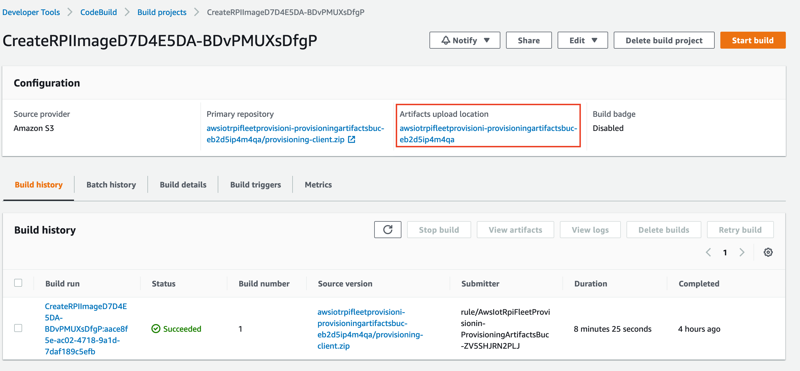

# Cloud Infrastructure for Daily Cattle Data Collection

Leverages [AWS CDK](https://aws.amazon.com/cdk/) to allow for the deployment of cloud resources to aid in the collection of dairy cow sensor data.

## Table of contents
- [Features](#features)
- [Installation](#installation)
- [Usage](#usage)

## Features

The core idea is to provice an extensible and scalable data collection platform using cloud resources. These resources are specified here, making deployment straigtforward.

The goal is to make it easy to set up raspberry pi gateways, collect and store the data produced by sensors, and then visualize the data being collected.

Two CDK [stacks](https://docs.aws.amazon.com/cdk/latest/guide/stacks.html) are provided with the following functions:

1. Build a custom raspbian based image with code from AWS's
[fleet provisioning sample](https://github.com/aws-samples/aws-iot-rpi-fleet-provisioning).
    - Allows devices to connect to an
    [AWS IoT](https://docs.aws.amazon.com/iot/latest/developerguide/what-is-aws-iot.html) instance on first boot
        - Requests a fully functional identity on first boot with the necessary IoT permissions that the device can use for subsequent communication with AWS IoT Core.  
        - Device will be added as a Thing to the [AWS IoT Core Thing Registry](https://docs.aws.amazon.com/iot/latest/developerguide/iot-thing-management.html)

2. Collect and store sensor data using cloud resources:
    - [TimeStream](https://aws.amazon.com/timestream/) database to store sensor data
    - [IoT Rule](https://docs.aws.amazon.com/iot/latest/developerguide/iot-rules.html) to forward incoming IoT messages to the database

## Installation
### Prerequisates
- [aws-cli](https://docs.aws.amazon.com/cli/latest/userguide/cli-chap-install.html) must be installed *and* configured with an AWS account on the deployment machine (see https://docs.aws.amazon.com/cli/latest/userguide/cli-chap-install.html for instructions on how to do this on your preferred development platform).
- [Node.js and npm](https://docs.npmjs.com/downloading-and-installing-node-js-and-npm)
- [AWS CDK toolkit](https://docs.aws.amazon.com/cdk/latest/guide/cli.html)

### Deployment
- Update the Wifi network SSID/country and public SSH key used to connect to your devices in the [lib/utils/constants.ts](lib/utils/constants.ts) file.
    - SSH isn't required, so the public key field can be left blank
- Install cdk dependencies with `npm install`
- Bootstrap your AWS environment to allow the use of the CDK with `cdk bootstrap`
- Optionally, run `cdk diff` to view what resources will be created
- To deploy, run `cdk deploy --all`
- Verify that the resources have been created in your account by going to the AWS console -> CloudFormation -> Stacks. Three stacks should be visible with `CREATE_COMPLETE` messages


## Usage
### Create custom image with fleet provisioning
The CDK stack creates a [CodePipeline](https://aws.amazon.com/codepipeline/) which builds the custom raspbian image and stores it in [S3](https://aws.amazon.com/s3/).

Once the stack is deployed, you can check the progress of the pipeline in the AWS console. Once the pipeline is completed, download the custom raspbian image from S3 (Check the "Artifacts upload location" in the Codebuild project to find the S3 bucket).



The CDK creates the following resources in total:
- A CodeBuild pipeline to build the Raspian image based on the configured source
- An S3 bucket to store unconfigured CodeBuilder source 
- A Lambda function to configure the source with certificates and the IoT endpoint
- An S3 bucket to store a configured CodeBuilder source 
- An S3 bucket to store the Raspian image


Unzip the image and write it on your Raspberry Pi sd card

```sh
unzip aws-raspbian.zip
# Find the SD card external disk
diskutil list external
# Write the image (replace /dev/disk123abcd with the name of the SD card external disk)
diskutil unmountDisk /dev/disk123abcd
sudo dd bs=1m if=aws-raspbian.img of=/dev/disk123abcd conv=sync
```

A Raspberry Pi booting using this image will automatically requests a fully functional identity on first boot with the necessary IoT permissions that the device can use for subsequent communication with AWS IoT Core (see [rpi-image-builder/firstboot.bash](rpi-image-builder/firstboot.bash)).
